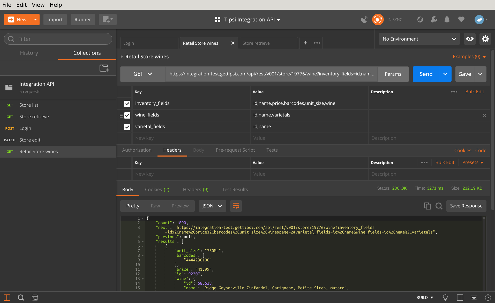

.. _list_or_create_operations:

List or create operations
=========================

List all store products
-----------------------

GET request to `/api/rest/v001/store/STORE_ID/wine` or `/api/rest/v001/store/STORE_ID/drink`
endpoint will list all the available products. The endpoints are paginated - they will return a
thousand results per page. You can modify page size by passing page_size parameter, but values
larger than a thousand will be ignored. By the way, all GET APIs are lazy - by default they will
only return object id. Fields should be requested explicitly as GET parameter - a comma separated
list of fields for each struct, see :ref:`RetailWineDynSerializer` and
:ref:`RetailDrinkDynSerializer` for the full structs description.

The example below requests wine inventory and nested fields (ids, barcodes, vintage and etc):

See :ref:`endpoints_store_products` for more details.

Add product to store
--------------------

POST request to `/api/rest/v001/store/STORE_ID/wine` or `/api/rest/v001/store/STORE_ID/drink`
endpoint will create a new inventory item, wine_id or drink_id parameter is required. Usually
you get wine_id or drink_id through full text search across Tipsi database. Other required
parameters - barcodes (can be an empty list, though) and external id (item ID in your database).
Params should be formatted as JSON dictionary.

The sample will create a new inventory item with assigned drink id 6755 and empty barcodes list.
Barcodes can be empty, but the parameter is required

.. image:: _static/store_add_drink.png

See :ref:`endpoints_store_products` for more details.
