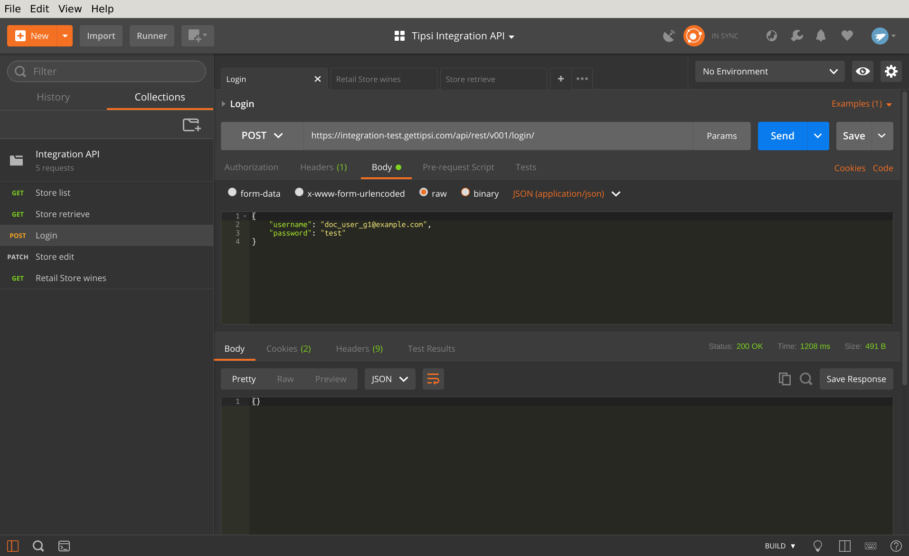
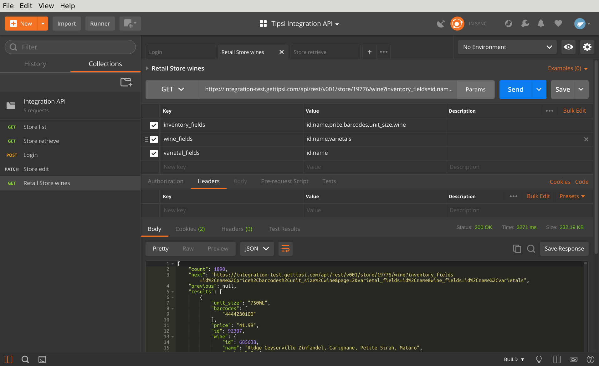

.. _quick_start:

Quick Start
===========

REST API
--------

Our API is RESTful, so any programming language will support interaction, but the document will
provide examples for `Postman <https://www.getpostman.com/apps>`_ .
Before calling private APIs, you need to create an authenticated session. It’s cookie-based, so
library needs to save cookies and pass them back with continuous calls, in most programming
languages it works out of box.

The example below will perform POST to login endpoint, call it once to create a new session:

If response status code is 200, you logged in successfully. Once it happened, any further call will
contain session ID in cookies header.

The other sample below will perform GET request to list wines endpoint - it will return a paginated
results set of all the available wines in store. The used store id is 19776, please change it to
your value provided by Tipsi.

Once you get your code working on test server, change it to production and go live!
